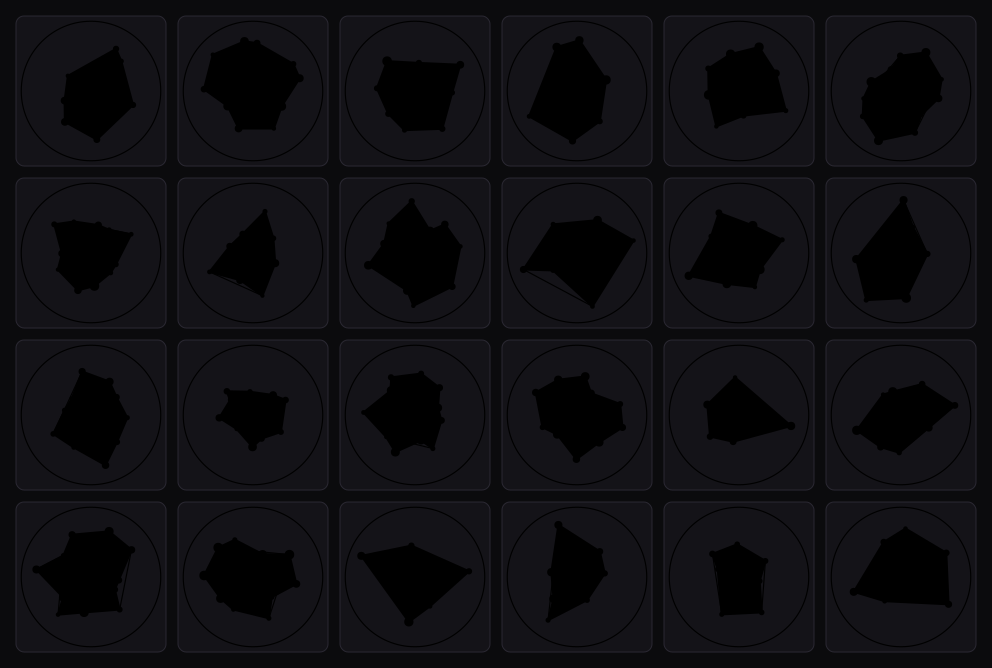

# lib-of-babel

**A living, walkable Library of Babel.** Start in a random hexagonal gallery, read the
books on its shelves, choose a hallway or a staircase, and walk forever. Every gallery
is generated deterministically from its coordinate, so the Library is infinite yet stores
almost nothing. Your **journey** is the only thing that is real enough to keep: the path
you walked and a cryptographic fingerprint of what each gallery held.



<sub>Each gallery has a **sigil**: a strange star-polygon emblem derived from its room hash. Same coordinate + universe → same sigil, forever (alphabet is a lens and does not change it). The 24 above are **real galleries** in the default universe — their coordinates, hashes, and permalinks are recorded in [`assets/sigils.json`](assets/sigils.json) (redraw with `node scripts/make-sigil-sheet.mjs`).</sub>

---

## Concept

Borges' Library is an indefinite number of **hexagonal galleries**. Each hexagon has six
sides: **four walls of bookshelves**, and **two opposite open sides** that lead into a
**hallway/vestibule** containing a **spiral staircase** running up and down. So from any
gallery you have **four moves**: two horizontal hallways, plus stairs up and stairs down.

Canonical dimensions we honor:

- 4 walls × 5 shelves × 35 books = **700 books per gallery**
- each book: **410 pages**, **40 lines/page**, **~80 chars/line**
- alphabet: **selectable lens** — Borges / Basile (default) / Basile++ / Basile#, plus language presets across Romance, Germanic, Uralic, Turkic, Hellenic, Slavic (Latin + Cyrillic), Baltic, Celtic, Caucasian, Semitic (Hebrew / Arabic / Persian), West African (N’Ko), Ethiopic (Amharic), African Latin, Berber (Tifinagh), CJK (Japanese kana / Korean Hangul / Simplified Chinese packs), and more (see in-app **About → alphabets**). Ids in `&a=` are stable registry keys (usually the glyph count; some diverge where counts collide). Changing alphabet **rewrites spines and pages** at the same `(universe, z, n)` without changing the room hash or sigil — not translation. RTL and complex-script lenses use `dir`/`lang` plus self-hosted Noto fonts (Arabic / Persian / N’Ko join; CJK uses subset JP/KR/SC faces).
- universe: **the outermost axis** — name a `universe` and you cross into an entirely separate infinite library (same rooms, wholly different books). Blank = the **default** universe. There are infinitely many, each reproducible from its name: a **multiverse**.

## Core design decisions

| Topic | Decision |
| --- | --- |
| **Topology** | `(z, n)` lattice. Hallways = `n ± 1`, staircase = `z ± 1`. Four moves per gallery. |
| **Books** | 700 deterministic spines/titles per gallery; full 410-page text generated **lazily** only when a book is opened; per-page **text** or **colour** view in the reader. |
| **Determinism** | Room identity: `(universe, z, n) → gallery_seed → 700 book_seeds → node_hash`. Content: project those slots through an alphabet lens → spines + pages. Nothing is stored. |
| **Hashing** | `node_hash` = **BLAKE3-256** **room** fingerprint over the 700 book-slot seeds (+ universe, version, coordinate). Alphabet does **not** enter the digest. The header shows the 64-bit prefix; the full 256-bit value is exposed for exports/proofs. |
| **Wanderings** | Bounded trail view (last 500 steps, newest-first; universe + alphabet frozen per visit) + append-on-step trail so the full path survives. Click a step to restore that gallery and its lens. |
| **Alphabet** | View lens (Borges / Basile / language presets; see About): same room hash/sigil, different text. Permalinks carry `&a=` as the active lens; journeys record the lens used. German / Dutch lenses also switch site chrome locale. Symbols are Unicode `char`s. |
| **Colour map** | Page + whole-book views map glyphs to OKLCH colours: letters on an accent-seeded hue wheel (min ~10° step), punct/digits on a muted opposite arc, space near-black. |
| **Universe** | A named seed (`""` = default / seed 0) folded into the gallery seed as the outermost axis → infinitely many parallel libraries. Set once as WASM global state; carried in permalinks (`&u=`) and exports. Names map to seeds via BLAKE3 so the mapping has one source of truth. |
| **Permalinks** | URL encodes `(z, n)` + universe (`u`, omitted when default) + alphabet (`a`) (+ optional `book`/`page`) with the gallery hash as a proof token; opening a link reproduces the exact view. |
| **Stack** | Rust → WebAssembly generator core + a static web frontend. |
| **Persistence** | Trail persisted to **IndexedDB**; export the **path** (addresses + moves) and **per-node hash** as JSON. Tessera `.tes` later. |

## The generation chain (never store text)

```text
(universe, z, n)              ──hash──▶  gallery_seed   (room identity)
gallery_seed + wall/shelf/i   ──hash──▶  book_seed
book_seed + page + alphabet   ──Feistel──▶  one page (3200 symbols; invertible)
410 pages                     ──join──▶  the full book
700 book-slot seeds           ─BLAKE3─▶  node_hash  (room fingerprint; alphabet-free)
```

Visit `(z, n)` today, next year, or from another machine → identical seed → identical
books, character for character. Open a book → generate on the fly → render → discard.

**The generator is the schema.** Alphabet, PRNG, hash function, page dimensions, and
seeding order must be **frozen and versioned**. Every export stamps a `generator_version`;
changing the core function invalidates previously exported paths/hashes.

## What gets stored (it's tiny)

Per step: `z` (8B) + `n` (8B) + `move` (1B) + `node_hash` (≤32B) ≈ **~50 bytes**. At human
pace (~1 gallery/sec) an hour of wandering is ~180 KB; a million steps is ~50 MB. The text
is never stored because it is always regenerable.

## Architecture

```text
lib-of-babel/
├── src/                 Rust → WASM generator core (deterministic, reversible-by-design)
│   ├── lib.rs           crate root, re-exports, integration tests
│   ├── config/          frozen dimensions, alphabets (ids + tables + registry), GENERATOR_VERSION
│   ├── prng.rs          SplitMix64 mixer + deterministic title stream
│   ├── universe.rs      active universe seed (WASM global state)
│   ├── gallery.rs       gallery/book seeds, titles, BLAKE3 fingerprint, lattice moves
│   ├── feistel.rs       reversible page PRP + address embedding
│   ├── page.rs          lazy page/book text generation + search embed
│   ├── search.rs        reverse lookup, validation, multi-page span planning
│   ├── color.rs         whole-book RGBA preview image
│   └── wasm_api.rs      wasm-bindgen JSON/string exports for the frontend
├── web/                 static frontend: gallery + minimap + sigil, book reader, wanderings, permalinks, export, verifier
│   ├── index.html       shell markup (CSS + scripts linked in)
│   ├── main.js          boot + session restore (wires controls)
│   ├── css/             app.css barrel · base · chrome · gallery · dialogs
│   ├── js/              modules: constants · wasm · util · db · state · url · book · view · nav ·
│   │                    about · controls · search · verify · theme · sigil · i18n · favicon · locales/
│   └── pkg/             wasm-pack output (generated; gitignored)
└── .mise.toml           local-dev toolchain + tasks (build / serve / dev / test)
```

The core is a **reversible mapping** between coordinate space and page content:
a Feistel permutation over each page's 3200 symbols, so **search-by-content**
(`text → coordinates`) is the inverse of reading (`coordinates → text`).

### WASM API (frontend ↔ core)

| Export | Purpose |
| --- | --- |
| `generator_version()` | Schema stamp — must match on verify/export |
| `set_universe` / `get_universe` / `universe_seed_for` | Multiverse axis |
| `gallery_titles_json(z, n, a, title_embed)` | 700 spine titles; optional embed flat string for title-search hits |
| `node_hash_hex` / `node_hash_full_hex` | 64-bit prefix / full BLAKE3-256 fingerprint |
| `page_text_for(…, search_query, search_start_page)` | One page; pass `-1` for no search embed |
| `locate_page_json(text, a)` | Reverse lookup (page content) → JSON hit or validation errors |
| `locate_title_json(text, a)` | Reverse lookup (spine title, max 24 chars) → JSON hit or validation errors |
| `search_page_span_for` / `search_page_embed_for` | Multi-page layout helpers |
| `book_text_for` / `book_image` | Full book text or RGBA colour map |
| `neighbor_json(z, n, mv)` | Lattice step (0=left, 1=right, 2=up, 3=down) |

## Search (`generator_version` 7)

**actions… → search…** opens a dialog with a **content / title** dropdown. Both modes use the alphabet selected in the header and stay in the universe you are standing in (no auto-hop to another library).

### Search by content

Paste a phrase in the **Search** modal ( **content** selected) → the core finds where it *already lives* in the current universe.

**How it works:**

1. **Validate** — only characters in the active alphabet are allowed (letters + trailing space/comma/period; extras depend on the lens). Invalid characters are highlighted in red; there is no auto-sanitize. Search result chrome follows the UI locale when a pack is active (e.g. German).
2. **Hash → address** — the normalized flat phrase is BLAKE3-hashed with universe + alphabet + version to get `(z, n, book, page)`.
3. **Embed** — the phrase is written into the generated page text at a deterministic offset (Basile-style: real surrounding text, not a padded overlay). Phrases longer than one page span consecutive pages contiguously: page 0 from the computed offset, continuation pages from column 0.
4. **Go there** — opens the book at the hit; permalink encodes coordinates + book/page + `q=` for the phrase.

**Limits:** up to one full book (~1.3M characters); must fit in the remaining pages of the resolved book. Multi-page hits show `page … page_end` in the result panel.

### Search by title

Choose **title** in the same dialog. Type a spine label (up to **24 characters**, same alphabet rules).

1. **Validate** — same alphabet rules as content search.
2. **Hash → address** — normalized title → `(z, n, book)` in the current universe.
3. **Embed** — the title is written onto the canonical spine for that book in the gallery (passed to `gallery_titles_json` as an embed string).
4. **Go there** — jumps to the gallery and opens the book at page 1 with the searched title on the spine.

```text
content:  user phrase  ──validate──▶  flat text  ──BLAKE3──▶  (z, n, book, page)  ──embed──▶  page text
title:    user title   ──validate──▶  flat text  ──BLAKE3──▶  (z, n, book)         ──embed──▶  spine label
```

## Run it locally (dev)

Tooling is managed by [mise](https://mise.jdx.dev/) (Rust + wasm-pack + uv). Activating it
puts its shims first on `PATH`, which sidesteps a Homebrew `rustc` shadowing rustup (the
`wasm32` target lives in the rustup toolchain, pinned by `rust-toolchain.toml`).

```bash
mise trust && mise install   # one-time: install the pinned toolchain
mise run dev                 # build the wasm core into web/pkg, then serve
```

Then open <http://127.0.0.1:8777/index.html>. The gallery shell shows **building library…**
until the WASM core finishes loading.

Other tasks:

- `mise run build` — release WASM build into `web/pkg`
- `mise run dev-fast` — faster debug build, then serve
- `mise run serve` — just serve `web/` (after a build); keeps running until you stop it
- `mise run test` — host unit tests (`cargo test`)
- `mise run check` — fmt + clippy + tests
- `cargo doc --open` — Rust API docs (host build; WASM-only items are still documented)

The trail lives in the browser's IndexedDB (per-device), so it survives reloads. **export**
downloads it as JSON; **new walk** clears it and drops you somewhere random.

**Permalink query params:** `z`, `n` (required), optional `u` (universe name), `a` (alphabet registry id), `book`, `page`, and `q` (search phrase when opened via content search).

Click **LIB·OF·BABEL** in the header for a tabbed in-app guide (overview, alphabets, wander, books, more). The **alphabets** tab browses lenses by family with short historical notes and source links; Literata is used for About prose.

Wide galleries use a 2×2 wall grid with fluid spine height/width; below ~960px walls stack so spines stay readable, and touch/coarse pointers use one horizontal shelf row per wall. Page chrome picks up a faint gallery-accent atmosphere; minimap, walls, and dialogs share the same accent-tinted panel. Header ☀/☾ toggles light/dark (preference saved locally; OS preference used when unset). The SVG favicon tints with the room accent after load (static gold/`favicon.png` as cold fallbacks).

## Roadmap (mirrored as Linear issues)

**Shipped (v1):**

1. ✅ **Generator core (Rust→WASM)** — `(z,n)` → gallery seed → 700 book spines; lazy book text; node hash; frozen `generator_version`.
2. ✅ **The walk** — 4 walls / shelves / color-coded spines, four move controls, keyboard nav, random start.
3. ✅ **Open a book** — lazily generated 410-page text with prev/next/jump paging; "borrow book" `.txt` download.
4. ✅ **Wanderings + export** — last-500 popup (newest-first; universe + alphabet columns), append-on-step trail in IndexedDB, JSON export.
5. ✅ **Orientation + sharing** — hexagon minimap previewing each exit's hash; URL permalinks for a gallery and an open book/page; copy-link and copy-hash.
6. ✅ **Alphabets (base)** — Borges / Basile plus early European language lenses; carried in permalinks (`&a=`) and exports.

**v2 — the multiverse:**

7. ✅ **BLAKE3 fingerprint** — `node_hash` is now BLAKE3-256 over the canonical book identities; 64-bit prefix shown, full 256-bit exposed for proofs.
8. ✅ **Multiverse** — named `universe` seed as the outermost axis → infinitely many parallel libraries; permalinks (`&u=`), export, persistence.
9. ✅ **Journey verifier** — import an exported path, re-walk it in WASM, and prove every hash (rejects tampering, wrong universe/alphabet lens, or wrong `generator_version`).
10. ✅ **Per-gallery sigil** — a generative emblem (irregular star-polygon glyph) drawn deterministically from the gallery hash; shown in the "you are here" panel, click to download the SVG.
11. ✅ **Reverse lookup** — search-by-content via Feistel page mapping + Basile-style embed. Paste a phrase → coordinates + deep-link; multi-page phrases, universe-scoped, strict alphabet validation.
12. ✅ **Search by title** — same search dialog with a content/title dropdown; up to 24 characters; embeds the title on the canonical spine and jumps to `(z, n, book)`.
13. ✅ **Room identity hash** — alphabet is a **lens** (`generator_version` 7): same `(universe, z, n)` keeps one room hash/sigil while spines and pages rewrite. Not translation.
14. ✅ **Multi-language alphabet lenses** — char-based registry + About family browser; Slavic / Baltic / Celtic / Caucasian packs and more; DE/NL UI locale packs when those lenses are active. ([THI-86](https://linear.app/thicclatka/issue/THI-86), [THI-118](https://linear.app/thicclatka/issue/THI-118))
15. ✅ **Gallery atmosphere + fluid shelves** — accent corner washes, dialog tint, viewport-driven spine sizing, accent-tinted favicon. ([THI-121](https://linear.app/thicclatka/issue/THI-121), [PR #4](https://github.com/Latka-Industries/lib-of-babel/pull/4))
16. ✅ **Narrow / touch layout** — stacked walls + stretch shelves ≤960px; touch scroll-row spines; compact mobile dialogs. ([THI-120](https://linear.app/thicclatka/issue/THI-120), [PR #5](https://github.com/Latka-Industries/lib-of-babel/pull/5))
17. ✅ **Frontend modularization** — CSS + JS split; `main.js` boot-only. ([THI-124](https://linear.app/thicclatka/issue/THI-124), [PR #6](https://github.com/Latka-Industries/lib-of-babel/pull/6))
18. ✅ **Light / dark theme** — header toggle, FOUC-safe preference, shared `--panel-tinted`. ([THI-125](https://linear.app/thicclatka/issue/THI-125), [PR #7](https://github.com/Latka-Industries/lib-of-babel/pull/7))
19. ✅ **RTL + Ethiopic + African lenses** — Hebrew / Arabic / Persian / N’Ko (joined via Noto), Amharic fidel, African Latin packs, Tifinagh. ([THI-88](https://linear.app/thicclatka/issue/THI-88))
20. ✅ **CJK / Hangul lenses** — Japanese kana gojūon, curated Hangul syllables, Simplified Chinese frequent-char pack (≤255 glyphs each; Noto JP/KR/SC subsets). ([THI-126](https://linear.app/thicclatka/issue/THI-126))

**Next:**

21. 🚧 **Punct mode axis** — optional punctuation richness as a second axis on every language lens ([THI-119](https://linear.app/thicclatka/issue/THI-119)).
22. 🚧 **Custom alphabet picker** — user-defined glyph sets beyond the built-in registry ([THI-123](https://linear.app/thicclatka/issue/THI-123)).
23. 🚧 **More UI locale packs** — es/fr/… beyond DE/NL ([THI-122](https://linear.app/thicclatka/issue/THI-122)).

**Later:**

- **Living membrane** — persisted discovery log ("coral growth"), wear paths ([THI-75](https://linear.app/thicclatka/issue/THI-75)).
- **Tessera export** — write the journey as a `.tes` document once Tessera ships ([THI-77](https://linear.app/thicclatka/issue/THI-77)).
- **Generative audio** per gallery ([THI-84](https://linear.app/thicclatka/issue/THI-84)).
- **Colour-mosaic search** — photo → alphabet mosaic → invert to book ([THI-117](https://linear.app/thicclatka/issue/THI-117)).

Repo: <https://github.com/Latka-Industries/lib-of-babel>

## Relation to sibling projects

- **[Tessera](../tessera)** (`.tes`) — open document format; the planned home for exported journeys.
- **Tetration** (`.tet`) — numeric tensors; optional, only if we want per-gallery float fingerprints.

## License

Private / unpublished. © Latka Industries.
